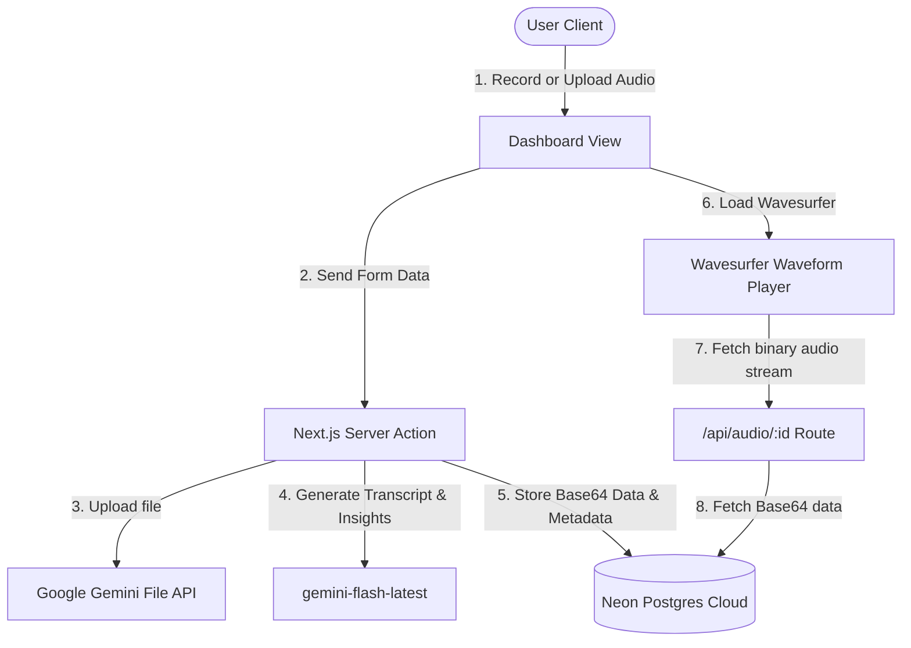

# 🎙️ AudioTranscribe AI

> A premium, full-stack audio intelligence platform that transcribes voice recordings in real-time, generates AI summaries, extracts action items, and renders interactive waveforms.

[](https://audio-transcription-app-coral.vercel.app/)
[](https://ai.google.dev/)
[](https://neon.tech/)

---

## 🌟 Core Features

- **🎙️ Browser Microphone Recorder**: Record meetings or voice notes directly from the web dashboard with an animated visual recorder and timer.
- **🌊 Interactive Waveforms**: Custom audio playback rendered as soundwaves using `wavesurfer.js`, featuring variable speeds (`0.5x` - `2.0x`) and interactive seek.
- **📍 Click-to-Jump Transcript**: Clicking on any paragraph timestamp (`[MM:SS]`) automatically seeks the audio player to that exact segment.
- **🧠 AI Summaries & Insights**: One-click extraction of bulleted summaries and checklist action items powered by Google's **Gemini 1.5 Flash**.
- **🏷️ Automated Topic Tagging**: AI-generated tags to easily categorize and sort through your transcripts list.
- **📥 Subtitle & Document Exports**: Download your structured transcripts instantly as plain text (`.txt`) or subtitle files (`.srt`).
- **🔐 Serverless & Secure Architecture**: Bypasses serverless file restrictions by encoding audio files directly into PostgreSQL as base64, serving them via dynamic API routes.

---

## 🛠️ Tech Stack

- **Framework**: Next.js (App Router, Turbopack)
- **Library**: React 19
- **Authentication**: Better-Auth (Credentials Provider)
- **Database & ORM**: Drizzle ORM + Neon PostgreSQL
- **AI Integration**: `@google/generative-ai` SDK
- **Styling**: Vanilla CSS (Fluid Variables & CSS Modules)
- **Media Processing**: `wavesurfer.js` (Web Audio API)

---

## 🏛️ System Architecture



---

## 📂 Database Schema

The database relies on Drizzle ORM with standard schemas for authentication and transcriptions:
- **`users` / `session` / `account` / `verification`**: Core tables managed securely via Better-Auth.
- **`transcripts`**: App data schema storing:
  - `id`: unique UUID identifier.
  - `text`: Verbatim transcript string containing paragraph timestamps.
  - `audioUrl`: Dynamically generated API path (`/api/audio/[id]`).
  - `audioData`: Base64 string of the binary audio.
  - `summary`: Bulleted summary.
  - `actionItems`: Stringified JSON checklist.
  - `tags`: Comma-separated list of category tags.

---

## 🚀 Local Development Setup

To run this project locally, follow these steps:

### 1. Clone the repository
```bash
git clone https://github.com/RaghavParasher/audio-transcription-app.git
cd audio-transcription-app
```

### 2. Configure Environment Variables
Create a `.env` file in the root directory:
```env
DATABASE_URL="postgresql://neondb_owner:..."
GEMINI_API_KEY="AIzaSy..."
BETTER_AUTH_SECRET="your-32-character-secret-key"
BETTER_AUTH_URL="http://localhost:3000"
```

### 3. Install Dependencies & Migrate Database
```bash
npm install
npx drizzle-kit migrate
```

### 4. Run the Dev Server
```bash
npm run dev
```
Open [http://localhost:3000](http://localhost:3000) in your browser.

> [!NOTE]
> Visit `http://localhost:3000/api/init` once to seed the database with the default administrator account.

---

## 🛡️ License & Data Privacy
Audio files uploaded to the Gemini File API are automatically deleted from Google AI servers after 48 hours. We never sell your data or use your transcription files to train AI models.
